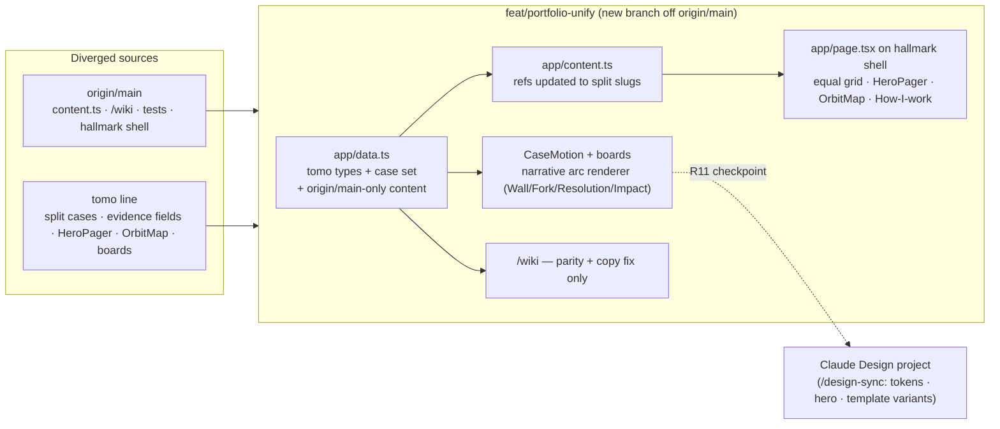

# feat: Unified portfolio — reconcile diverged lines into an evidence-first editorial redesign

## Overview

Reconcile the two diverged development lines of the portfolio into one canonical redesign, then rebuild the case pages around a problem→fork→resolution→impact narrative template. The two lines are:

- **origin/main ("hallmark line", built on the mac mini 07-12~07-14):** superior _infrastructure_ — `app/content.ts` centralized cross-view facts, `/wiki` static index view with reciprocal view switch, Playwright smoke suite + deterministic `check` gate (`typecheck && lint && test && build`), `next/image` discipline, orphan-dependency cleanup, hallmark design shell (sage-paper tokens, texture stack, Instrument Sans / IBM Plex Mono / Bricolage Grotesque). But its _content regressed_: crowned flagship object, standalone `far-cards` case, merged `taptato-base-world` case, "AI × Web3 Product Engineer" title throughout, and the forbidden "55 public commits across 6 repos" claim is back.
- **feat/portfolio-upgrade ("tomo line", live on tonypark.xyz):** correct _content structure_ per the binding positioning rules — split `taptato` / `base-world` cases, far.cards/Mintdrop/Brainlets folded under Mint Club as `subProjects`, `ownership` / `proofDetail` / `sourceNeeded` evidence fields — plus the signature interactive pieces: `HeroPager` (receipt pager hero), `OrbitMap` (provenance tree of satellites → ecosystem anchors), case boards, FINDING-001~006 design fixes.

**Resolution principle: adopt origin/main as the architectural base; adopt the tomo line as the content-structure source of truth; fix copy to the positioning rules on top; keep exactly two signature interactions (HeroPager, OrbitMap).** The five conflicted files (`app/data.ts`, `app/globals.css`, `app/layout.tsx`, `app/page.tsx`, `app/objects/[slug]/CaseMotion.tsx`) are resolved by rebuild-on-base, never by textual merge.

Design direction (agreed in session, 2026-07-15): case-page bones modeled on benshih.design (narrative + metrics), presentation restraint modeled on rauno.me / emilkowal.ski, and the differentiator is Tony's own evidence-first culture — receipts, public ledger, "source pending" honesty. The site is "the receipts portfolio", not a clone of any reference.

## Problem Frame

Two machines developed the same site independently for a week (no shared patches; `git cherry` = 0 equivalents). A textual merge conflicts in 5 core files that both sides substantially rewrote with different design systems. Beyond reconciliation, Tony wants the portfolio restructured to carry a career narrative — problems hit, forks chosen, resolutions shipped, and contributions to companies/ecosystems (Base et al.) — for many projects not yet represented. The primary reader is a founder hiring a founding/product engineer; the goal is hiring conversion. Narrative raw material arrives later (TODOS.md); the structure must ship first with labeled placeholders.

## Requirements Trace

- **R1** — One unified line on a new branch off origin/main; all origin/main infrastructure preserved (content.ts model, /wiki, Playwright + check gate, next/image, eslint config). (origin: session decision)
- **R2** — Case structure restored to positioning rules: equal object grid (no crowned flagship), `taptato` and `base-world` as separate cases, far.cards + Mintdrop + Brainlets as Mint Club `subProjects`, 6 object routes (retired slugs live on as redirects, see R9). (origin: positioning memory 2026-07-04, highest authority)
- **R3** — Signature pieces ported: `HeroPager` as hero visual (with Doto `--font-lcd` + lcd tokens), `OrbitMap` as an ecosystem-contribution section, case boards (`OwnershipBoard`, `ProofDetailBoard`, `SubProjectsBoard`, `BeeperExtras`). (origin: session decision)
- **R4** — Case pages rebuilt around a narrative arc rendered from `fieldNotes` with standardized titles (Wall / Fork / Resolution / Impact), designed for scan-level reading. At least one real arc (Beeper, authored from already-sourced material with Tony's sign-off) ships at deploy so the template is validated against real content; cases without a conforming arc render no narrative section at all (existing boards only — absence is never advertised). (origin: user request "문제→고민→해결→임팩트 서사" + review decisions 2026-07-15)
- **R5** — Copy re-audit: public title is **"Product Engineer"** everywhere in chrome/H1/metadata ("Founding Product Engineer" only inside the hire/fit block); every "AI × Web3 Product Engineer" occurrence fixed (layout.tsx:29/38/46, page.tsx:98/126, wiki/page.tsx:16/41/84); "55 public commits across 6 repos" removed (page.tsx:49). The binding docs themselves (PRODUCT.md positioning language, DESIGN.md title/palette) are reconciled in the same sweep so docs match shipped reality. (origin: positioning memory + EVIDENCE-MAP.md)
- **R6** — Evidence discipline preserved end-to-end: `sourceNeeded` → visible "source pending" chip; no claim without a receipt link; no hardware-engineering implication; Brainlets viral claim held until receipt. (origin: EVIDENCE-MAP.md, TODOS.md)
- **R7** — origin/main-only content merged in: Base APAC builder feature (fieldEntry, beeper proofPoints/timeline), beepworks frontend-proof screenshots, EwhaChain field images. (origin: session repo-research report 2026-07-15 — content verified present only on origin/main)
- **R8** — `/wiki` kept as a low-investment secondary view; case-name parity with the visual view maintained after the case restructure; masthead copy fixed. Why it stays: the index serves fast-scanning secondary readers (grant/hackathon reviewers) and machine/LLM readers who get handed the portfolio to summarize; content.ts parity keeps upkeep near zero. (origin: session decision)
- **R9** — Retired routes redirect: `/objects/far-cards` → `/objects/mint-club`, `/objects/taptato-base-world` → `/objects/taptato` (mechanism: `next.config.ts` redirects like `hunt-mintclub`, but with `permanent: true` → 308, deliberately diverging from that precedent's `permanent: false`/307 because these are permanent retirements).
- **R10** — Deterministic gate green (`npm run check`) with tests updated for by-design changes and extended for new surfaces; then production deploy to tonypark.xyz and post-deploy verification.
- **R11** — Design checkpoint after the case-template draft renders: push tokens + hero + case-template variants + receipt cards + OrbitMap frame to a Claude Design project via /design-sync for Tony's visual review before final polish. (origin: user request 2026-07-15)
- **R12** — Home carries a "How I work" module (the F-001 editorial process ladder: primitive → prototype → interface → distribution → proof), absent on origin/main's home. (origin: 07-06 plan R6 / QA §P1, carried forward)

## Scope Boundaries

- **Not** inventing narrative content — authoring from already-sourced material is allowed and required for one case: U3 drafts the Beeper arc from EVIDENCE-MAP safe claims + existing fieldNotes, signed off by Tony at the U8 checkpoint. All other cases' raw material (TODOS.md) fills `fieldNotes` later without code changes.
- **Not** resolving the pending-receipts list (Brainlets viral tweet, Base World grant proof, Jesse Pollak shoutout, etc.) — those claims stay off the site entirely, or behind a "source pending" chip only where a claim already legitimately ships, per R6/EVIDENCE-MAP.
- **Not** a /wiki redesign — parity and copy fixes only.
- **Not** deleting the mac mini's hallmark skill artifacts (`.agents/skills/hallmark/`, `.hallmark/`) — they ride along untouched.
- Skin choice (hallmark sage-paper vs tomo warm-paper tokens/fonts) defaults to **hallmark shell** but is deliberately swappable at the R11 checkpoint — both are CSS-variable-level changes.

## Context & Research

### Relevant Code and Patterns

- `app/content.ts` (origin/main) — cross-view facts with resolved views that throw on bad slug refs at build; route files must not re-declare its consts (enforced by test). All new/renamed slugs must update `productSurfaces[].caseSlug` **and** `primitives[].exampleCaseSlug` here (`taptato-base-world` is referenced by both today; `proofDeck` carries no reference to it).
- `app/data.ts` (tomo line) — richer `CaseStudy` + `ProofPoint{sourceNeeded}`, `Ownership`, `ProofDetail`, `SubProject`, `OrbitEra` types; split case set; `thread` backlink (base-world → hunt-town).
- `app/objects/[slug]/CaseMotion.tsx` — origin/main keeps Beeper consts inline; tomo line extracted boards. Adopt boards, keep origin/main's frontend-proof-board (beepworks shots — asserted by tests), convert all raw `` to `next/image` (test: "CaseMotion source has no raw ``").
- `tests/portfolio-smoke.spec.ts` (origin/main, 257 lines) — the de-facto flow spec: route 200s, no horizontal overflow at 320–1440, content-integrity (slug resolution, both views show same case names, fieldEntry sources https), image discipline, reciprocal view switch at 320px. Several assertions break **by design** with this plan (flagship link text, case set, video hrefs) — update alongside, never delete the categories.
- `next.config.ts` — redirect pattern for retired slugs.
- Fonts: HeroPager requires Doto (`--font-lcd`) added to layout.tsx alongside the hallmark font set.
- Reveal mechanism: origin/main `HomeMotion.Reveal` (motion/react) wins; tomo `ScrollReveal.tsx` (selector-based IntersectionObserver) is **not** ported — one mechanism only. FINDING-003's scroll-rhythm intent is carried by Reveal wrappers.
- F-001…F-006 = the tomo line's six design-fix commits (`git log --grep=FINDING` on feat/portfolio-upgrade): F-001 How-I-work process ladder, F-002 TradeFish proof line, F-003 scroll-reveal rhythm, F-004 touch targets, F-005 video play affordance, F-006 pager tap behavior.
- Dependencies: gsap (tomo-only, used for a case entrance animation) is dropped — replace with motion/react or CSS; origin/main already removed unused `@radix-ui/react-slot`, `clsx`, `tailwind-merge`.

### Institutional Learnings

- `docs/solutions/` is empty; the binding local knowledge base is `EVIDENCE-MAP.md`, `PRODUCT.md`, `DESIGN.md`, `TODOS.md`, plus the completed plan `docs/plans/2026-07-06-001-feat-portfolio-upgrade-plan.md` (content-model-first philosophy carried forward).
- Doc drift found by research: local PRODUCT.md is the stale "Prototyper" text; origin/main PRODUCT.md and DESIGN.md still encode "AI × Web3 Product Engineer"; DESIGN.md's palette values match _neither_ branch's actual tokens. Docs are reconciled in U5.

### External References

- Reference sites (session research, all verified live 2026-07-15): benshih.design (case narrative bones), rauno.me / emilkowal.ski (restraint), brianlovin.com (work + side-project weaving), maggieappleton.com / leerob.com (wiki view calibration), wattenberger.com (meaning-bearing motion — OrbitMap's bar).
- Live comparison URLs: tonypark.xyz (tomo line), preview `tony-portfolio-site-dfmzwg4jv-tonys-projects-2c76b22f.vercel.app` (origin/main).

## Key Technical Decisions

- **Rebuild-on-base over merge:** the 5 conflict files are rewritten on the new branch using origin/main as the file skeleton and tomo content grafted in; no `git merge` of the two lines is attempted. Rationale: both sides rewrote the same files against different design systems; a textual merge produces neither.
- **Content-model-first (carried from 07-06 plan):** every structural change is data on `CaseStudy`/content.ts; components render generically; routes/sitemap/static-params auto-derive.
- **Narrative = standardized `fieldNotes`, not a new type:** keep `fieldNotes: {title, body}[]` (TODOS.md already targets it) with canonical machine-key titles (Wall / Fork / Resolution / Impact) and a redesigned narrative renderer in CaseMotion that maps keys → display labels (U8's A/B picks the labels; storage never changes). Rationale: Tony's authoring flow stays a short per-case text drop; no schema migration when content arrives. U5 updates TODOS.md's per-case template from 3 prompts to 4 (해결+결과 splits into Resolution / Impact) so material authored to the template actually conforms.
- **Two signature interactions, hard cap:** HeroPager + OrbitMap. Everything else calm (Reveal fades only). Rationale: session design decision — motion budget goes to meaning-bearing pieces; wow-for-wow reads as slop in 2026.
- **Hallmark shell as default skin, swappable at checkpoint:** its anti-slop constraints, responsive-tested layout, and /wiki styling are the newest deliberate system; skin is token-level so the R11 checkpoint can flip palette/fonts without structural rework.
- **HeroPager receipt strings re-derived from `data.ts` case metrics/proofPoints** during port (currently hardcoded in-file) so the pager can't drift from the evidence map. content.ts holds only cross-view primitives/surfaces/deck/field facts — the pager's values ('44,850', '39.1', '412K+' etc.) live in data.ts, which is the single source of truth for case claims and carries `metricSource`.
- **Canonical-line policy after merge:** GitHub main becomes canonical; the mac mini pulls instead of pushing independent work (operational note, communicated to Tony).

## Open Questions

### Resolved During Planning

- Which line is the base? → origin/main for architecture; tomo line for content structure (research showed origin/main's content regressed vs binding positioning rules).
- Reveal mechanism? → HomeMotion `Reveal`; ScrollReveal not ported.
- gsap? → dropped; motion/react + CSS cover the case entrance.
- Retired-route handling? → next.config redirects (R9), matching the existing `hunt-mintclub` precedent.
- far.cards ledger row? → stays in the public ledger (EVIDENCE-MAP rule: rows keep their public source).
- Later-arriving arcs (TODOS.md material) → adopt the U8-approved template as-is; no re-checkpoint unless the template itself changes.

### Deferred to Implementation

- Exact narrative-section layout (typography, metric placement) — iterated at the R11 design checkpoint with Tony's input; 2–3 variants pushed via /design-sync.
- Final skin (hallmark sage vs warm-paper) — Tony's call at the checkpoint; both token sets kept ready.
- Wiki h2 outline changes — only if case restructure forces them; the smoke test's exact-order assertion is updated to whatever ships.
- Whether Beeper's video boards keep exact current hrefs — re-validated against EVIDENCE-MAP during U3.
- Whether `/objects/far-cards` should target `/objects/mint-club#subprojects` (anchor to the strip) instead of page top — decide once the subProjects section id exists in U3.
- Whether pager receipt claims carry a visible `metricSource` cue inside the hero, or the hero is exempt (claims stay sourced in data.ts either way) — settle at the R11 checkpoint.

## High-Level Technical Design

> _This illustrates the intended approach and is directional guidance for review, not implementation specification. The implementing agent should treat it as context, not code to reproduce._

Unit dependency order: U1 → U2 → {U3, U4} → **U8(design checkpoint)** → U5 → U6 → U7 → U9(deploy). U8 needs only U3+U4 rendering; running it before U5/U7 means DESIGN.md reconciliation and test consolidation happen once, after the skin/layout decisions are locked, instead of twice.

## Implementation Units

- [ ] **Unit 1: Branch, backup, and baseline gate**

**Goal:** Safe working surface: new branch `feat/portfolio-unify` off origin/main; tomo line backed up; baseline check gate green.

**Requirements:** R1

**Dependencies:** None

**Files:**

- No source changes; branch ops + `public/proof/brainlets-site.png` copied over from the tomo line (asset union).

**Approach:**

- Pre-flight: confirm over SSH that the mac mini has **zero unpushed commits on main** and no autonomous agent is mid-work there BEFORE creating the branch — the divergence pattern this plan exists to fix must not recur underneath it. If unpushed commits exist: have the mini push first, then re-verify this plan's branch-state anchors (R5 line refs, R7 content inventory, content.ts slug refs, tip `eab54a9`) against the new tip; any delta in the 5 conflict files becomes new rebuild-on-base input.
- Push the 10 unpushed tomo commits to `origin/feat/portfolio-upgrade` first (the live deploy's source must not exist only on one laptop).
- `npm ci` + `npx playwright install --with-deps` (first Playwright run on this machine — the tomo line never carried `@playwright/test`) + `npm run check` to establish the baseline before any edit; `npm ci` pins to origin/main's lockfile instead of re-resolving `latest` ranges.

**Test scenarios:**

- Test expectation: none — branch/asset scaffolding; the baseline gate run is itself the verification.

**Verification:**

- `feat/portfolio-upgrade` visible on GitHub; new branch builds green with the untouched origin/main suite.

- [ ] **Unit 2: Content model unification (`data.ts` + `content.ts`)**

**Goal:** One data layer carrying the tomo structure and all origin/main-only content.

**Requirements:** R2, R6, R7, R9

**Dependencies:** Unit 1

**Files:**

- Modify: `app/data.ts`, `app/content.ts`, `next.config.ts`
- Test: `tests/portfolio-smoke.spec.ts` (content-integrity section — update case set expectations here if the suite hard-codes slugs)

**Approach:**

- Port tomo types (`ProofPoint{sourceNeeded}`, `Ownership`, `ProofDetail`, `SubProject`, `OrbitNode/Group/Era`, `thread`) onto origin/main's `CaseStudy`; keep `metricSource`.
- Add a structured `pagerReceipts: {value, label}[]` field (populated only with metricSource-backed values) — the pager's numbers exist today only inside prose strings (`proofPoints` bodies, `metricSource` text), so a structured field, not prose parsing, is what keeps U4's HeroPager derivation mechanical.
- Case set → beeper, mint-club, hunt-town, tradefish, base-world, taptato (+ far.cards/Mintdrop/Brainlets as mint-club `subProjects`). Brainlets ledger row 006 cites the live site as its only source — the viral-reach claim appears **nowhere** (not even as a pending chip) until Tony supplies the receipt, per EVIDENCE-MAP.
- Merge origin/main-only content: Base APAC fieldEntry + beeper proofPoints/timeline entries; keep FINDING-002's TradeFish "1st — Base Agent Hackathon · Solana Malaysia Demo Day" line (sourced).
- Update `content.ts` refs from `taptato-base-world` to the split slugs: `productSurfaces[].caseSlug` → `taptato`, and the wallet-infrastructure primitive's `exampleCaseSlug` → `taptato` (the playable wallet-infra demo per the 07-06 plan); resolved-view build-time throws are the safety net.
- Add redirects for `/objects/far-cards`, `/objects/taptato-base-world`.

**Test scenarios:**

- Happy path: build succeeds — resolved views throw on any dangling slug (this is the primary integrity check).
- Happy path: 6 object routes return 200 (auto-derived from `cases`); the 3 retired paths (hunt-mintclub, far-cards, taptato-base-world) are covered by the redirect scenario below, not this one.
- Edge case: redirected slugs return 308 → new targets.
- Integration: sitemap contains split-case URLs and no retired slugs.

**Verification:**

- `npm run check` green at this commit with updated content-integrity expectations.

- [ ] **Unit 3: Case pages — boards + narrative arc renderer**

**Goal:** Case template rebuilt: tomo boards on origin/main's CaseMotion skeleton, plus a designed narrative section rendering standardized fieldNotes.

**Requirements:** R3, R4, R6, R7

**Dependencies:** Unit 2

**Files:**

- Create: `app/objects/[slug]/OwnershipBoard.tsx`, `app/objects/[slug]/ProofDetailBoard.tsx`, `app/objects/[slug]/SubProjectsBoard.tsx`, `app/objects/[slug]/BeeperExtras.tsx` (ported), narrative section inside `app/objects/[slug]/CaseMotion.tsx`
- Modify: `app/objects/[slug]/CaseMotion.tsx`, `app/globals.css` (case-page styles)
- Test: `tests/portfolio-smoke.spec.ts` (image-discipline + case sections)

**Approach:**

- Keep origin/main's section order and progress nav; graft boards; keep frontend-proof-board (beepworks) inside BeeperExtras "media" slot.
- All ported boards' raw `` → `next/image`. Extend the suite's source scan from CaseMotion.tsx alone to **every `.tsx` under `app/objects/[slug]/`** — extracting boards into separate files would otherwise move the ported `` tags outside the existing single-file scan, making the enforcement vacuous for exactly the code it targets.
- Narrative renderer — storage vs display are decoupled: the four canonical titles (Wall/Fork/Resolution/Impact) are **stable machine keys in data.ts**, chosen because they cannot collide with legacy titles (tradefish already carries "Problem"/"Decision" today); the renderer maps canonical keys → display labels, and the U8 label A/B decides **display labels only** — no data re-authoring and no conformance change follows the verdict.
- Conformance is all-or-nothing per case: a conforming case's fieldNotes are **exactly** the four canonical titles (extra material folds into the four bodies; never rename a subset of a case's titles to arc vocabulary). Conforming cases get the designed arc treatment, and the arc section **replaces** the field-notes board (fieldNotes are consumed by exactly one renderer). Everything else keeps the existing board layout with **no arc section and no "pending" label** — absence is not advertised, and "source pending" chips stay strictly reserved for evidence claims.
- Conformance guard (asserted in U7): any case whose fieldNotes contain ≥1 canonical title must contain all four, else the gate fails — partial arcs can never silently degrade into cryptic board headings.
- "Metric callouts" = renderer-level typographic emphasis of metrics already present in the authored arc copy (numerals get the callout treatment; Impact is where numbers naturally live per the authoring template). No new schema, no per-step metric mapping.
- Author the Beeper arc from EVIDENCE-MAP safe claims + existing Beeper fieldNotes (Problem/My role/Constraint/What I learned) as the template's reference content; Tony signs off at the U8 checkpoint before it ships.
- Legacy fieldNotes stay untouched (their titles remain and render on the existing board); only Beeper is re-authored to the canonical set in this plan. Later TODOS.md material upgrades a case by replacing its fieldNotes with the four canonical titles wholesale.
- Replace the gsap entrance with motion/react or CSS.

**Execution note:** Update the smoke suite's case-page assertions in the same commits that change behavior — the gate stays green unit-by-unit, never "fix tests at the end".

**Test scenarios:**

- Happy path: `/objects/beeper` renders metrics, mechanic, media boards, ownership, narrative; `/objects/mint-club` renders subProjects strip incl. Brainlets.
- Happy path: a case with conforming fieldNotes (Beeper) shows the arc section and **no** field-notes board (one renderer per case); one without renders boards only — assert the arc section is absent and no "pending" copy appears anywhere.
- Error path: a fixture-level check that a case carrying 1–3 canonical titles fails the conformance guard (all-or-nothing).
- Edge case: `sourceNeeded` proof point renders the "source pending" chip and no href.
- Error path: unknown slug still 404s via `generateStaticParams`.
- Integration: no raw `` in CaseMotion source; case hero keeps srcset + eager load; no horizontal overflow at 390/1440 on `/objects/beeper`.

**Verification:**

- All 6 case routes render the new template; gate green.

- [ ] **Unit 4: Home rebuild on the hallmark shell**

**Goal:** Home carries the agreed structure: equal object grid, HeroPager hero, OrbitMap section, How-I-work ladder — on origin/main's shell.

**Requirements:** R2, R3, R12, R5 (structure part)

**Dependencies:** Unit 2 (can overlap Unit 3)

**Files:**

- Create: `app/HeroPager.tsx`, `app/OrbitMap.tsx` (ported)
- Modify: `app/page.tsx`, `app/HomeMotion.tsx` (if Reveal wrappers need variants), `app/layout.tsx` (add Doto `--font-lcd`), `app/globals.css` (lcd tokens, `.pager-*`, `.orbit-*`, equal-grid, process-ladder, F-004/F-005 CSS)
- Test: `tests/portfolio-smoke.spec.ts` (home sections)

**Approach:**

- Replace `flagship-object` + `support-list` with the equal `object-grid` (Beeper first, "current · proof-dense" tag only).
- Port the tomo line's `#hire` best-fit module (pitch H2, "Email Tony" CTA, résumé download, best-fit roles list) — this is the home's conversion endpoint and the "hire/fit block" R5 refers to; origin/main's skeleton has only a CTA-less one-liner, so omitting the port would regress the live site's only next-action above the footer.
- Replace the visible-chrome title strings during the page.tsx rebuild (topbar `<em>`, hero kicker → "Product Engineer") so the U8 checkpoint judges final copy — kicker length roughly halves, which shifts hero balance; metadata/wiki/docs stay in U5.
- Delete `proofDeck`/`resolvedProofDeck` from content.ts and their three suite references (import, slug-integrity assertion, re-declaration-guard regex) in the same commit that removes ProofDeck — nothing else consumes them (verified: /wiki doesn't), matching the orphan-cleanup precedent (12f7d13).
- HeroPager into `hero-visual`, **replacing ProofDeck** — one hero unit; the two-interaction hard cap rules out relocating ProofDeck elsewhere. Receipts derive from `data.ts` case metrics/proofPoints (see Key Technical Decisions); F-006 tap behavior travels with the port.
- OrbitMap as a new `#orbit` section (ecosystem-contribution story) between surfaces and ledger; its internal links target the Unit-2 case set.
- Add How-I-work process ladder (F-001 editorial style) — R12; absent on origin/main's home.
- OrbitMap touch/keyboard treatment (nodes are real links — verified pure-CSS `:hover` today): nodes stay plain, immediately-navigating links; **no first-tap interception** (double-tap is an anti-pattern and iOS Safari's `:focus-within` on tapped links is unreliable). On touch, the chain relationship is carried by always-visible connector rails + semantic hierarchy markup (nested lists/headings for era → anchor → satellite); the interactive chain highlight remains a hover/`:focus-visible` enhancement for pointer and keyboard users.
- Re-apply F-004 (touch targets) and F-005 (video play affordance) to hallmark class equivalents.
- Remove the "55 commits" line from `companySurfaces` while touching page.tsx (copy sweep completes in U5).

**Test scenarios:**

- Happy path: home renders hero pager (tappable, advances on click/Enter), equal grid with 6 case cards, orbit section with era groups, ledger, how-i-work, and the `#hire` module with working contact actions (mailto + résumé links resolve).
- Edge case: reduced-motion → pager static path, Reveal renders content without animation.
- Edge case: no horizontal overflow at 320/375/414/768/1440 (existing assertion re-run against new sections).
- Integration: every orbit satellite/anchor internal link resolves 200.

**Verification:**

- Gate green; visual spot-check at 320 and 1440.

- [ ] **Unit 5: Copy & binding-docs re-audit**

**Goal:** Positioning rules enforced in every user-visible string and in the binding docs themselves.

**Requirements:** R5, R6

**Dependencies:** Units 3–4 + U8 verdicts (DESIGN.md token/palette reconciliation must reflect the checkpoint's skin decision, or it goes stale immediately)

**Files:**

- Modify: `app/layout.tsx`, `app/page.tsx`, `app/wiki/page.tsx`, `PRODUCT.md`, `DESIGN.md`, `EVIDENCE-MAP.md` (only if the Brainlets row note needs syncing), `TODOS.md` (check off what this plan resolves)
- Test: `tests/portfolio-smoke.spec.ts` (add copy-guard assertions)

**Approach:**

- Title sweep: the visible-chrome strings (topbar `<em>`, hero kicker) were already replaced in U4 so U8 judged final copy; U5 verifies those and covers the rest — metadata (layout.tsx title/OG/Twitter), wiki masthead/infobox/meta, binding docs. "Founding Product Engineer" only in the hire/fit block (the tomo `#hire` module ported in U4); **case-insensitive** grep (`grep -i`) for `AI × Web3` and `Prototyper` must end at zero in app copy — page.tsx:126 is the uppercase kicker `AI × WEB3 PRODUCT ENGINEER`, which a case-sensitive guard silently misses.
- Update TODOS.md's per-case authoring template to the four canonical prompts (벽/갈림길/해결/임팩트 — 해결+결과 splits in two) so future raw material conforms to the arc criterion.
- Remove/verify removal of "55 public commits across 6 repos".
- Reconcile PRODUCT.md/DESIGN.md to the positioning memory (title, equal grid) and to the actual shipped tokens (DESIGN.md palette currently matches neither branch).

**Test scenarios:**

- Happy path: new copy-guard test — rendered `/` and `/wiki` match none of `/ai × web3/i`, `/55 public commits/i`, `/commits across 6 repos/i` (case-insensitive; the hero kicker ships uppercase).
- Edge case: hire/fit block still says "founding product engineer" (allowed context — assert presence there, absence elsewhere).

**Verification:**

- Grep + rendered-page assertions both clean; gate green.

- [ ] **Unit 6: /wiki parity pass**

**Goal:** Wiki reflects the unified case set and fixed copy with minimal investment.

**Requirements:** R8, R5

**Dependencies:** Unit 5

**Files:**

- Modify: `app/wiki/page.tsx`, `app/wiki/wiki.css` (only if layout breaks)
- Test: `tests/portfolio-smoke.spec.ts` (wiki section)

**Approach:**

- Update Selected work to the split case set (parity test: both views show the same case names); masthead/infobox/meta title fixes land in U5, verified here; update the exact-h2-order assertion to whatever outline ships.

**Test scenarios:**

- Happy path: `/wiki` 200, single h1, updated h2 order assertion, no broken local images.
- Integration: reciprocal view switch at 320px still works both directions; both views list identical case names.

**Verification:**

- Wiki section of the suite green.

- [ ] **Unit 7: Test-suite extension and full gate**

**Goal:** The deterministic gate covers the new surfaces so future edits can't silently regress them.

**Requirements:** R10

**Dependencies:** Units 2–6

**Files:**

- Modify: `tests/portfolio-smoke.spec.ts` (or a sibling spec file if it grows unwieldy)

**Approach:**

- Consolidate assertions added in U2–U6; add: redirect checks (far-cards, taptato-base-world), OrbitMap link integrity, pager keyboard accessibility (Enter advances), narrative-section presence for conforming cases, copy guards.
- Extend the suite's hardcoded case-route check to all 6 routes — today it names only 3; the "auto-derives from `cases`" behavior belongs to the separate internal-links test, not this one.

**Test scenarios:**

- The unit _is_ test work; scenario inventory = the list above plus every pre-existing category (routes, overflow, content-integrity, image discipline, view parity) passing unmodified in intent.

**Verification:**

- `npm run check` green from a clean install.

- [ ] **Unit 8: Design checkpoint — /design-sync to Claude Design**

**Goal:** Tony reviews the real go-forward system visually and makes three distinct calls: skin, narrative-template variant (incl. the label A/B), and — separate from the visual decisions — factual sign-off on the authored Beeper arc copy (the R4 deploy gate).

**Requirements:** R11, R4 (Beeper-arc sign-off)

**Dependencies:** Units 3–4 rendering (gate need not be fully green)

**Files:**

- Create: a small preview-card bundle (build artifact, e.g. `design-sync/` in the scratchpad or a git-ignored local dir — not committed) rendering: token sheet, HeroPager frame, 2–3 case-narrative template variants, a boards-only (non-conforming) case card for arc-vs-no-arc side-by-side contrast, receipt/proof cards, OrbitMap frame.
- Modify (verdict fold-back): `app/globals.css` (tokens), `app/objects/[slug]/CaseMotion.tsx` (narrative renderer labels/layout), `app/layout.tsx` (font swap if the skin verdict flips the stack)

**Approach:**

- Scope stays small (the judgment-needing pieces only, per session agreement — Tony explicitly requested the Claude Design loop; side-by-side variant cards are the point, which live URLs alone don't give). Push via the DesignSync tool flow (list → finalize_plan → write).
- Division of labor: **Claude Design is the decision surface, the repo is the implementation surface.** Tony iterates variants visually in Claude Design; each verdict is folded back into globals.css/CaseMotion by the implementing agent. Claude Design cannot run the check gate, git, or the deploy pipeline, so no implementation happens there.
- Include a narrative-label A/B among the variants: metaphor labels (Wall/Fork/Resolution/Impact) vs plain labels (Problem/Decision/Resolution/Impact) — **display labels only**; storage keys never change (see U3). The cold reader is real: a fresh-context agent (or outside person) does a 90-second read and answers PRODUCT.md's three conversion-goal questions; that read supplies the A/B verdict and its findings feed the polish pass.
- Verdicts may arrive asynchronously (cards persist in Claude Design); if the checkpoint stretches more than a few days, re-run the U1 anchor verification before proceeding to U9 — the main-freeze assumption decays with time.
- Fallback if DesignSync is unavailable in the executing session: render the same cards as a local HTML bundle on a Vercel preview and review by URL.
- Collect Tony's verdicts; fold skin/layout decisions back into globals.css tokens and the narrative renderer; the losing token set is deleted in the same commit the decision lands.
- A gstack /design-review iterative pass follows the verdicts for polish.

**Test scenarios:**

- Test expectation: none — review artifact, no site behavior change; decisions feed back into Units 3–5 files under the existing suite.

**Verification:**

- Tony has made the skin + template-variant calls; decisions applied and gate re-run green.

- [ ] **Unit 9: Ship — PR, deploy, and canonical-line switch**

**Goal:** Unified line becomes GitHub main and the live site; divergence risk closed out.

**Requirements:** R10

**Dependencies:** Units 1–8

**Files:**

- No new source; PR + deploy operations; memory/process notes.

**Approach:**

- PR `feat/portfolio-unify` → main with the divergence story in the body; after merge, `vercel --prod` (scope `tonys-projects-2c76b22f`), verify tonypark.xyz serves the unified build (OrbitMap present, `/wiki` 200, redirects live).
- Operational: mac mini pulls main; GitHub main declared canonical going forward; session memory updated to close the "diverged" state.

**Test scenarios:**

- Test expectation: none — release operations; post-deploy verification below acts as the acceptance check.

**Verification:**

- Live URL spot-checks: `/` shows equal grid + pager, `/objects/taptato` 200, `/objects/far-cards` redirects, copy guards pass against production HTML, and `/objects/beeper` serves the signed-off real narrative arc (R4 gate).

## System-Wide Impact

- **Interaction graph:** `content.ts` resolved views throw at build on dangling slugs — every slug rename must land in data.ts + content.ts + orbit data in the same commit. The smoke suite's source-level regex (route files must not re-declare content consts) constrains where ported components may define copy.
- **Error propagation:** build-time throws are the chosen failure mode for content integrity (fail fast in `check`, nothing degrades silently at runtime).
- **State lifecycle risks:** none server-side (fully static); client state is confined to HeroPager index and Reveal visibility.
- **API surface parity:** `/` and `/wiki` must present the same case set (tested); redirects preserve inbound links to retired routes; sitemap auto-derives.
- **Integration coverage:** reciprocal view switch, orbit internal links, redirect targets — all cross-surface behaviors have named scenarios in Units 2/4/6/7.
- **Unchanged invariants:** `/wiki` structure and wiki.css stay essentially as-is (R8); `next.config.ts` existing redirect and Tailwind/postcss setup untouched; EVIDENCE-MAP safe-claim lists unchanged — this plan consumes them, it does not relax them.

## Risks & Dependencies

| Risk                                                                                            | Mitigation                                                                                                                                                                                                                                                                                                                       |
| ----------------------------------------------------------------------------------------------- | -------------------------------------------------------------------------------------------------------------------------------------------------------------------------------------------------------------------------------------------------------------------------------------------------------------------------------- |
| Ported tomo components clash visually with the hallmark shell (fonts/tokens differ)             | U4 re-derives pager/orbit CSS against hallmark tokens; R11 checkpoint catches misfit before polish; skin is token-swappable                                                                                                                                                                                                      |
| Smoke suite's exact-text assertions (flagship link, wiki h2 order, video hrefs) fail mid-work   | Update assertions in the same commit as the behavior change (U3 execution note); never batch test fixes at the end                                                                                                                                                                                                               |
| Mac mini keeps committing to main during this work                                              | U1 pre-flight verifies the mac mini holds no unpushed main commits; U9 lands fast; main frozen for the branch's lifetime — if main moves anyway, re-apply its new commits by the same rebuild-on-base rules (hand-graft changes into the 5 rebuilt files, cherry-pick the rest); never a textual rebase across the rebuilt files |
| Narrative sections look empty until Tony's raw material arrives                                 | No absence labels: non-conforming cases render boards only (no arc section); Beeper ships with a real arc (R4) so the template never demos empty; remaining cases upgrade silently as TODOS.md raw material lands                                                                                                                |
| Hallmark's `body::before/after` texture layers interact badly with ported orbit/pager z-indexes | Keep ported components under z-20; assert visually at U4; overflow tests catch layout breakage                                                                                                                                                                                                                                   |
| Claude Design sync scope creep (whole site instead of judgment pieces)                          | U8 hard-scopes the bundle to tokens/hero/template/cards/orbit frame                                                                                                                                                                                                                                                              |

## Documentation / Operational Notes

- PRODUCT.md / DESIGN.md become accurate again in U5 — future agents on either machine read binding docs that match shipped reality.
- TODOS.md: narrative raw-material task stays open for the remaining five cases; this plan ships the container **plus one fully-authored, signed-off arc (Beeper — R4)**. TODOS.md's per-case template moves to four prompts in U5.
- Post-merge process rule (communicate to Tony): one canonical line (GitHub main); machines pull before working; no independent parallel redesigns.
- Deploy remains manual `vercel --prod` per memory `vercel-deploy-mechanics`.

## Sources & References

- Origin: session conversation 2026-07-15 (divergence investigation → direction agreement → reference research); no docs/brainstorms document exists.
- Prior plan: `docs/plans/2026-07-06-001-feat-portfolio-upgrade-plan.md` (content-model-first philosophy, R-numbering convention).
- Binding: `EVIDENCE-MAP.md`, `PRODUCT.md`, `DESIGN.md`, `TODOS.md`.
- Branch state: origin/main `eab54a9`; tomo line `cdc0802` (live); merge-base `6788bcf`.
- References: benshih.design, rauno.me, emilkowal.ski, brianlovin.com, maggieappleton.com, leerob.com, wattenberger.com.
